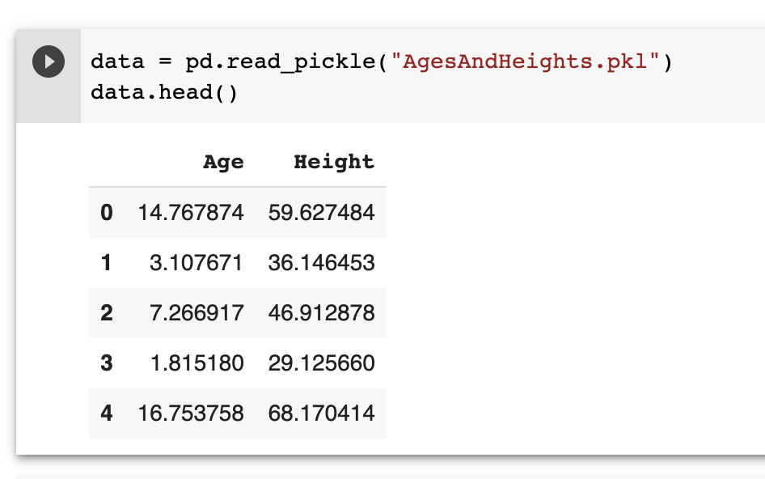
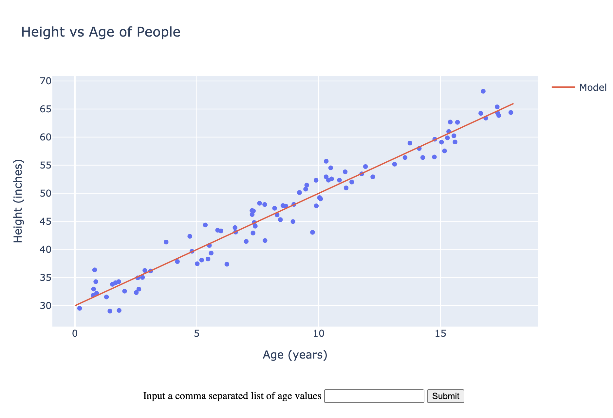

# Machine Learning: From modeling to deployment

This repository aims to train a ML model and deploy it to production.
This tutorial will be structured in two parts. In Part I, we're going to build the model using Google Colab and build a Flask application that serves the application. Part II will be dedicated for hosting the application on Heroku.

Part I: Modeling & Flask Application

Our objective in this modeling is to build a model that predicts the **height** of a person given their **age**. For that we're going to use the following dataset:

The dataset can be downloaded [here](https://archive.org/download/ages-and-heights/AgesAndHeights.pkl)

The notebook we used for the modeling can be found in this repo under: `notebooks/ML - Prediction of Height by age.ipynb`

After the training we save the model which can be found under `app/model.joblib`.

Once we train, the model we make a simple Flask application that serves the model. In order to run the application on your local, you need to run the following:

## Install

Install this repo by cloning the *main branch* and installing required dependencies:

    $ git clone git@github.com:koutouodilon/ml_flask.git
    $ cd ml_flask
    $ python3 -m venv .env
    $ source .env/bin/activate
    $ pip install -r requirements
    $ cd app
    $ flask run

After running the previous commands, the application can be found here: http://127.0.0.1:5000/ and looks like this:

You can enter a list of age values comma seperated.

Part II: (coming soon)

References:
- https://www.youtube.com/watch?v=qNF1HqBvpGE

